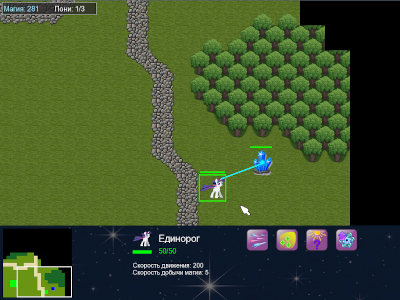
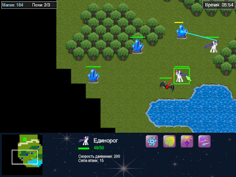

# Игра "Экспансия единорогов", стратегия в реальном времени

## О проекте

Жанр игры - тактическая игра с элементами RTS. Двумерная карта, вид сверху, с прокруткой по игровому миру, а также мини-картой. Карта открывается по  мере продвижения юнитов. В распоряжении игрока — призываемые единороги, которые можно получить в портале за единицы магии. Единороги ходят по прямой (вертикали и горизонтали), обходят препятствия. Выстрелы идут автоматически при виде противника, когда он оказывается на расстоянии стрельбы (не только по прямой, в любом направлении на расстояние, меньшее или равное длине стрельбы). Сама стрельба реализована как непрерывная атака лучом-линией. 

 

Противник представляет собой вражеские юниты, а также источники этих юнитов в виде строений, с некоторой периодичностью создающие новые юниты врагов. Юниты могут быть в пассивном состоянии, могут случайно перемещаться по карте, могут двигаться по заданному маршруту, а также целенаправленно атаковать портал игрока. В любом случае, при приближении единорога к зоне видимости юнита он начинает атаку на единорога. Все вражеские юниты - ближнего боя, для урона единорогу, они должны подойти вплотную.

Базовая цель игры, соответственно, отбить все атаки и очистить карту от вражеских юнитов и строений, при этом не дав разрушить свой портал (не обязательно). На разных уровнях могут быть реализованы разные цели, например, добыть сколько-то магии, продержаться заданное время или добраться до заданного места на карте. Уровни также различаются количеством вражеских юнитов и строений, активностью юнитов и источниками ресурсов.
Для каждого уровня могут быть заданы доступные игроку специализации единорогов (виды и уровни специализаций) и улучшения портала, а также начальные значения улучшений.

**Проект находится в разработке, текущее состояние - ранний прототип, доступны 4 карты.**

## Основные механики игры:

1. Каждый единорог имеет одну или несколько специализаций, которые можно за добытую магию ему назначить. Также специализация имеет уровни, при назначении следующего уровня, её эффективность возрастает.
2. Значение магии возрастает за добытые на карте ресурсы, собираемые единорогами со специализацией сбора. Ресурсы могут быть как точечные (волшебные кристаллы), так и протяженные (полезные ископаемые на поверхности).
3. Управление классическое мышкой (левой кнопкой выделение, правой - команда движения), но без возможности выделить группу единорогов, команды движения отдаются по очереди, действия специализаций (сбор, лечение, атака) выполняются автоматически при нахождении объекта для действия специализации в зоне действия.
4. В портала доступны улучшения для единорогов - можно заказать эа единицы магии несколько уровней улучшений. Улучшения будут касаться только единорогов, выпущенных после изучения улучшения. Изучение каждого нового улучшения стоит дороже, поэтому делать максимальное изучение улучшений невыгодно.
5. Число единорогов, доступных игроку, ограничено. Их количество можно несколько раз повысить, заказав улучшения в портале за единицы магии.

## Специализации единорогов

1. Атака - с помощью красного луча единорог атакует ближайшего к нему противника. Улучшение специализации - сила атаки.
2. Сбор ресурсов - с помощью синего луча единорог добывает магию из находящихся в зоне действия ресурсов. Улучшение специализации - скорость сбора.
3. Лечение - с помощью зеленого луча единорог лечит ближайших к нему единорогов, кроме самого себя. Улучшение специализации - скорость лечения. Лечение расходует магию.
4. Разведка - единорог может вызвать заклинание, которое откроет карту в радиусе от его местоположения. Сначала изучение, потом применение.

Все специализации имеют несколько уровней.

## Улучшения единорогов в портале

1. Защита - увеличивает максимальный запас здоровья единорога.
2. Скорость - увеличивает скорость движения единорога.
3. Максимальное количество пони - увеличивает количество единорогов, доступное игроку на поле.

Все улучшения имеют несколько уровней.
