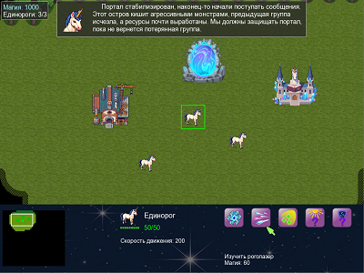
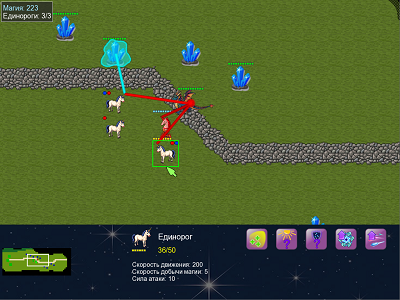

# Игра "Экспансия единорогов", стратегия в реальном времени

[](https://yoomoney.ru/to/41001497003495)
[](https://boosty.to/ponygames)
[](https://tav-developer.itch.io)
[](#)
[](#)
[](#)

## О проекте

Жанр игры - двумерная RTS с классической системой "здания/юниты/ресурсы".
В распоряжении игрока — пони-единороги, которых можно призвать из портала за единицы магии.
Главная особенность игры - новые единороги не имеют действий, кроме перемещения,
им нужно изучать различные заклинания для выполнения работы (сбор ресурсов, атака, лечения).
Один единорог может иметь несколько специализаций, а также повышать уже
имеющиемся специализации.
Улучшения для единорогов, а также полезные машины для добычи и обороны
можно заказывать в зданиях, которые тоже призываются из портала.
Сам портал, в свою очередь, может быть улучшен для увеличения числа
доступных единорогов и ускорения их призыва.

 

В текущей версии, доступен обучающий сценарий, 4 карты мини-кампании, сюжетно
связанные, а также две миссии испытаний. Кампания и испытания поддерживают
три уровня сложности. Для разной сложности,
может меняться количество врагов, требования к заданиям и даже сами задания.

Проект создан на С++, использует библиотеки SFML, ZetScript и jsoncpp.

**Игра находится в разработке, текущее состояние - завершенный прототип**

## Сборка проекта

Доступны два варианта построения игры - для Visual Studio и для MinGW.
В обоих случаях нужно добавить в каталог `UnicornExpansion/UnicornExpansion`
файл `version.h`:

```
#pragma once
const char * VERSION = "v1.0.0" ;
```

В проекте используются субмодули библиотек ZetScript, JsonCpp и SFML 3.0.0,
ссылки модулей ведут на их репозитории github.
Перед сборкой проекта нужно получить модули командами:

```
git submodule init
git submodule update
```

### Сборка для Visual Studio

Нужно открыть решение `UnicornExpansion/UnicornExpansion.sln` и построить проект
для архитектуры x64, конфигурация Release. Для запуска нужно поместить в каталог с exe-файлом
библиотеки dll от SFML 3.0 для Visual Studio. Сборка проверена на Visual Studio 2019 и 2026
Все зависимости вроде SFML, ZetScript и JsonCPP уже включены в состав проекта
в каталог `libs.static.vs2019`
как собранные .lib-файлы 64-битных версий для Visual Studio 2019.
Для 2026 студии можно использовать эти же файлы.
Заголовочные файлы этих библиотек берутся из каталогов субмодулей.
Также необходимо скопировать в субмодуле `zetscript` файл
`src\Config.h.in` в каталог `src\base` под именем `Config.h`

### Сборка для MinGW

Используется CMake, для сборки вызывается файл `build_mingw64.bat`
из корня репозитория, сборка не требует готовых бинарных файлов библиотек,
готовый бинарный файл будет размещен в каталоге bin,
запускать его нужно командой `UnicornExpansion.exe ..\data`
Сборка проверена на mingw версии 15.

### Сборка для gcc под Linux

Используется CMake, для сборки вызывается файл `build_gcc.sh`
из корня репозитория, сборка не требует готовых бинарных файлов библиотек,
готовый бинарный файл будет размещен в каталоге bin,
запускать его нужно командой `./UnicornExpansion ../data`
Сборка проверена на gcc версии 15.

#### Указания по сборке для Ubuntu 24.04 под WSL2

Нужно установить инструменты для сборки, библиотеки зависимостей SFML
и утилиту AppImage:
```
sudo apt update
sudo apt install build-essential
sudo apt install cmake
sudo apt install \
    libxrandr-dev \
    libxcursor-dev \
    libxi-dev \
    libudev-dev \
    libfreetype-dev \
    libflac-dev \
    libvorbis-dev \
    libgl1-mesa-dev \
    libegl1-mesa-dev \
    libfreetype-dev \
    libharfbuzz-dev \
    libmbedtls-dev \
    libssh2-1-dev
sudo apt install libfuse2
wget https://github.com/AppImage/AppImageKit/releases/download/continuous/appimagetool-x86_64.AppImage
sudo install -m 0755 appimagetool-x86_64.AppImage /usr/local/bin/appimagetool-x86_64.AppImage
```
